# Campus_card
模仿武汉轻工大学的校园卡管理系统 

快速开发完成的为了项目管理课设，
所以在数据库表关系上没有设置外键啥的，就4张表
一下是其中的一部分 代码不美观，感觉low了，见谅，还有一些小bug 分页那。。，功能及没完善

前后端简单分离项目
编译器集成开发环境IDE  前端 HbuildX  后端 IDEA2019
前端开发环境  node.js 
后端开发环境  java
运行环境 vue ElementUI  html css js axios  maven springboot mybatis-plus Mysql5.6
服务器用springboot内嵌的tomcat（端口改为9000）， 前端服务器vue项目运行默认端口8080，
axios解决跨域请求完成数据交互  

### 登录模块

背景图是变化的

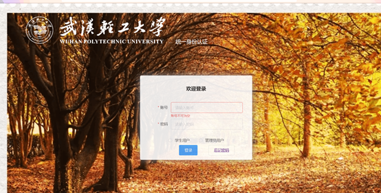

当输入的账号密码与数据库不一致时 可点击返回链接返回上一级

### 用户主界面 登录成功后即可看到所有账单

​                               

### 重点功能的实现

### 修改密码

如登录时的忘记密码界面、

​      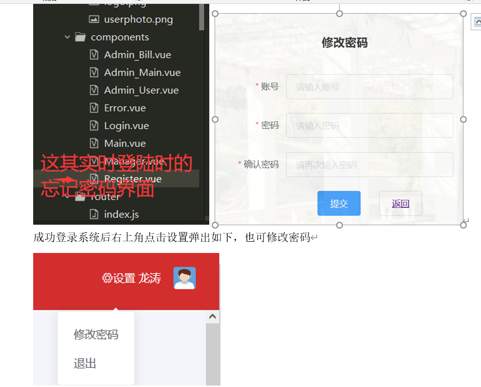

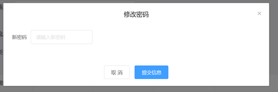

这是目前数据库对应密码，修改成功后 提示如下，在去数据库中查看已经发生改变

​                               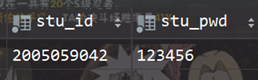

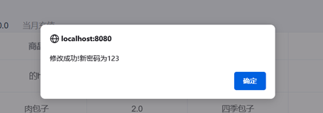

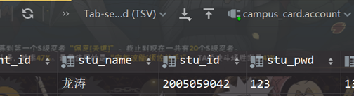

### 账单的多条件查询

日期查询

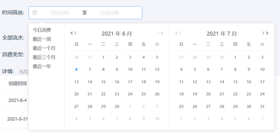

查看今日消费 确实没的

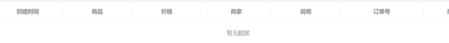

当选择最近一周时

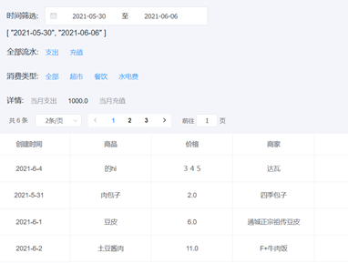

修复数据库时间 查看一个月 我这是根据今日一个月往前推，你也可以点击选择日期区间

都没问题

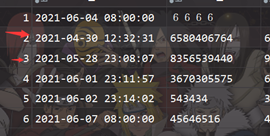

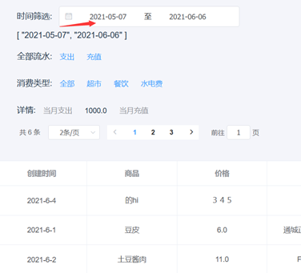

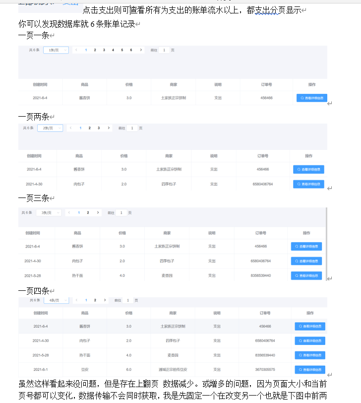

超市 餐饮 水电费

这三个模糊查询时间问题没有具体实验，因为就和查看支出一样对应数据库语句*select \* from* bill *where* classify *like* '%**%' 即模糊查询 

### 充值功能

点击充值按钮 我们先充个100 我们先看看数据库中银行卡余额，（真实情况，用户肯定去专门的手机银行app查看）这里只是模拟 钱很多啊 希望变真哈哈

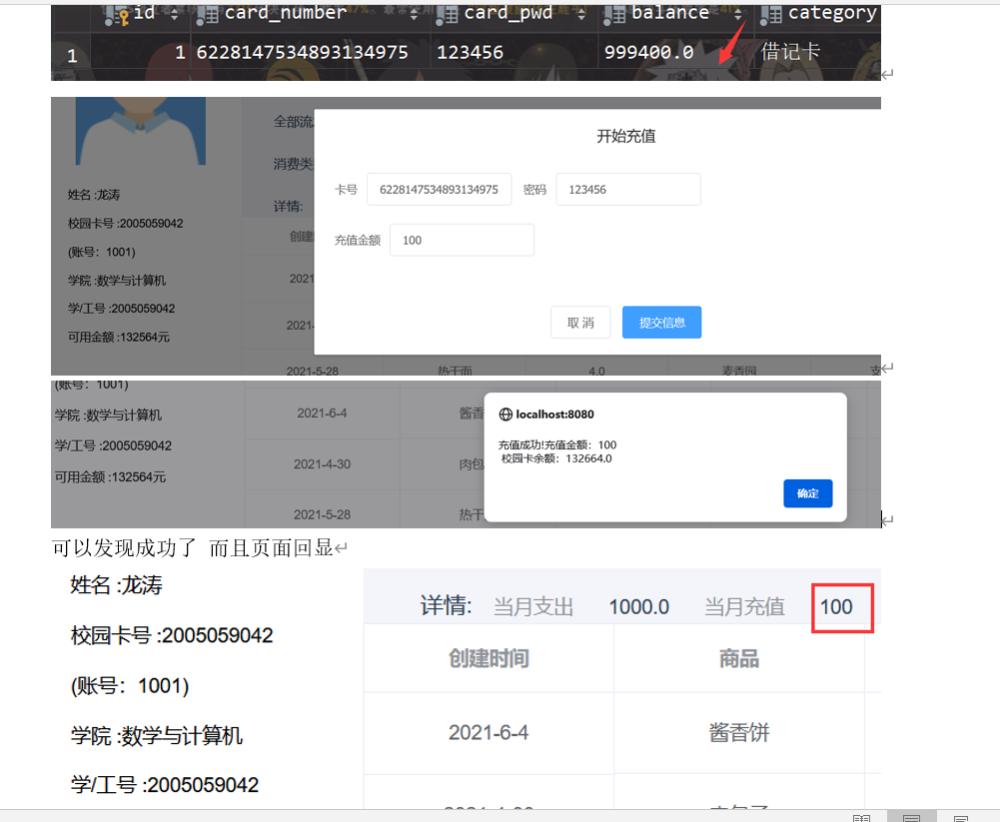

银行卡则减了一百

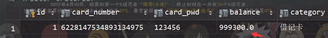

### 退出系统

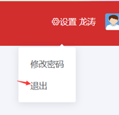

### 管理员界面

登录窗口输入管理员账号密码并选择管理员方式登录 后台打印的日志

#### 查询

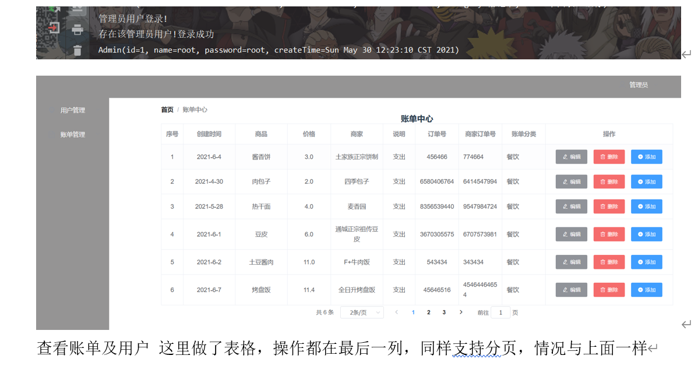

#### 用户修改

​                               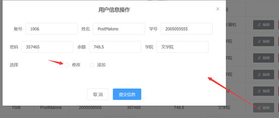

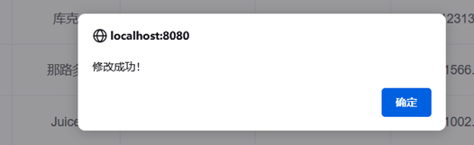

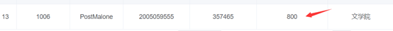

#### 用户添加

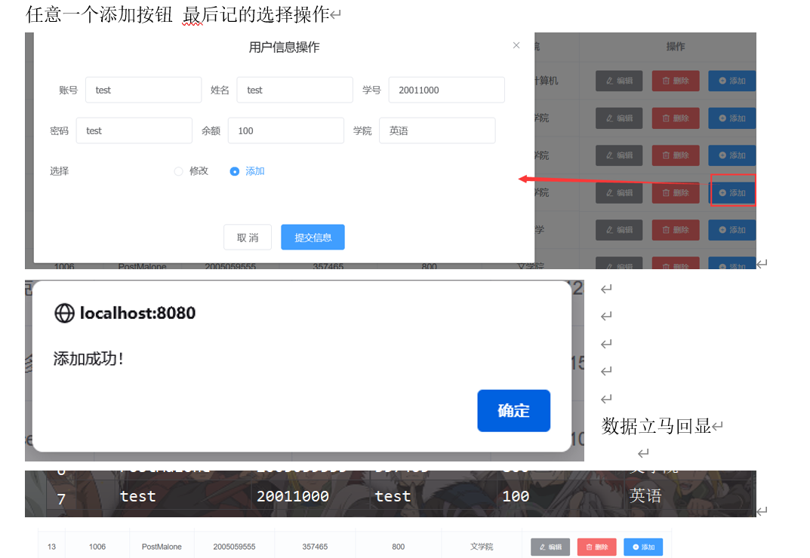

弹出对话框点击之外其他地方都可关闭

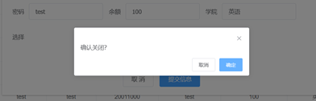

没有选择操作类别时  提交出现如下提示

​                               

#### 删除用户

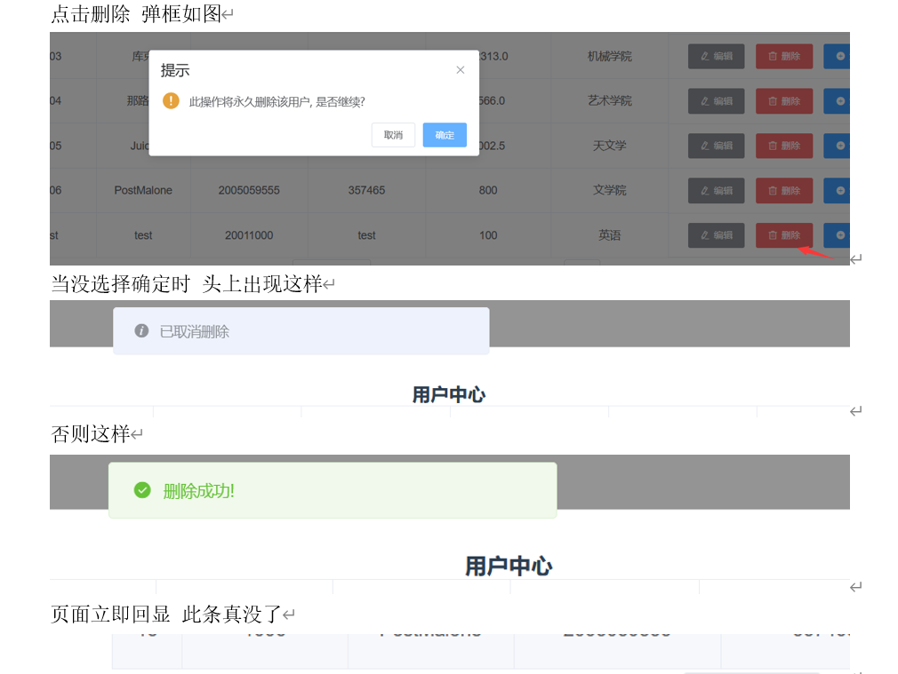

### 账单管理 

这个就不写了~~一样的--
